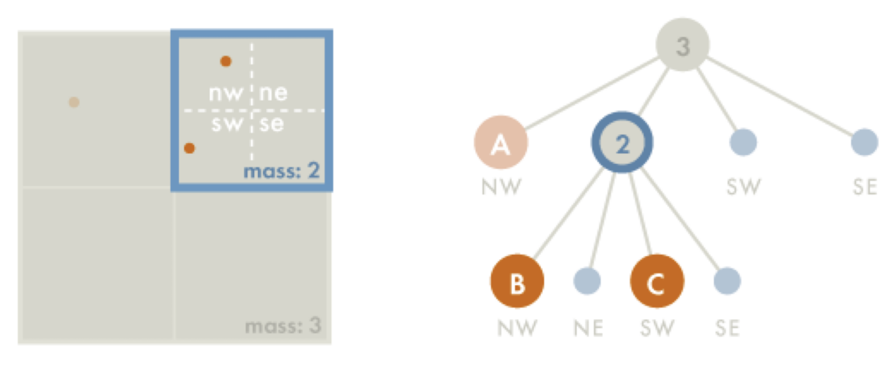

# 🪐 Barnes-Hut Simulation

[]()
[]()
[]()

This is a course project in **Programming for Scientist**

## ✨ Overview
This project simulates the gravitational interaction of stars using the **Barnes-Hut algorithm**, a spatial partitioning technique that approximates N-bodies efficiently. 

Each partical in the system move under the influence of others' gravititional forces. Instead of computing all pairwise interaction, we use **quadtree** to approximate clusters as single bodies, reducing the complexity to roughly O(nlogn).

<p align="center">
  
</p>


## 🧩 Algorithm
### 1. Barnes–Hut Principle
The Barnes–Hut Principle recursively divides the 2D simulation space into quadrants, forming a quadtree:
* Each **leaf node** represents one body.
* Each **internal node** represents the `center of mass` and `total mass` of all bodies within that quadrants.

When computing the force on a body, if a node if far enough, it treats that entire region as a single body instead of calculating individual forces.

### 2. Building the Quadtree
To construct the quadtree, we recursively subdivide the 2D space into four equal-sized regions until each region contains at most **one body**.

#### Steps:
1. **Define simulation boundary**  
   Start with a square region that encloses all bodies.

2. **Insert each body**  
   For each body:
   - If the node is empty → store the body there.  
   - If the node already contains one body →  
     subdivide the node into **four child quadrants**:  
     - Northwest (NW)  
     - Northeast (NE)  
     - Southwest (SW)  
     - Southeast (SE)  
     Then, reinsert both the existing and the new body into the appropriate child according their position.

3. **Aggregate mass information**  
   After all bodies are inserted, each internal node computes:
   - M = sum of all masses in the quadrant
   - r_cm = (1 / M) * sum(m_i * r_i) for all i in the quadrant
    where `M` is the total mass and `r_cm` is the **center of mass** of that quadrant.

This process yields a tree where upper levels represent clusters of bodies and lower levels represent individual bodies.

<p align="center">
  
</p>

<p align="center">
  <em>Figure: Supossing that we are adding C to the quadtree. (Left) B and C occupy the same quadrant, so the space is subdivided into four equally sized subquadrants. (Right) In the quadtree structure, we divide the node previously pointing to B into four leaves based on the four subquadrants, and assign B to the “NW” subquadrant and C to the “SW” subquadrant.</em>
</p>


### 3. Gravitational Force Computation
The forces between two bodies/clusters is calculated by Newton's law:

F_ij = G * (m_i * m_j) / r_ij^2 * r_hat_ij

where:
- `G` is the gravitational constant,  
- `r_ij` is the distance between the two bodies/clusters,  
- `r_hat_ij` is the unit vector from i to j.

When applying the Barnes–Hut approximation, we only use the center of mass of a node if:

s / d < theta

where:
- `s` = width of the region,  
- `d` = distance from the body to the region’s center of mass,  
- `theta` = opening angle threshold.
---
## ⚙️ Simulation Dynamics
Each time step consists of:
1. **Building the Quadtree** — recursively partitioning the space based on ball positions.  
2. **Computing Forces** — traversing the quadtree to accumulate gravitational forces.  
3. **Updating Positions and Velocities** — using simple Euler integration

---

## 📁 File Structure
```
Boids/
│
├── main.go # Entry point
├── datatypes.go # BarnesHut structures
├── functions.go # Functions for simulation
├── functions_test.go # test functions for subroutines
├── initialization.go # Functions for initialing galaxy system
├── drawing.go # GIF visualization
├── Data/
│ └── jupiterMoons.txt # inout data for commant argument "jupiter"
├── Tests/ 
│ └── ComputeCenterAndMass.txt # Test data and expected output for function `ComputeCenterAndMass`
│ └── Distance.txt # Test data and expected output for function `Distance`
│ └── FindQuadrant.txt # Test data and expected output for function `FindQuadrant`
│ └── IsInsideUniverse.txt # Test data and expected output for function `IsInsideUniverse`
│ └── IsLeaf.txt # Test data and expected output for function `IsLeaf`
│ └── Subdivide.txt # Test data and expected output for function `Subdivide`
│ └── UpdatePosition.txt # Test data and expected output for function `UpdatePosition`
│ └── UpdateVelocity.txt # Test data and expected output for function `UpdateVelocity`
├── output/
│ └── galaxy_collision.gif # GIF outputs for command argument "collision"
│ └── galaxy_galaxy.gif # GIF outputs for command argument "galaxy"
│ └── galaxy_jupiter.gif # GIF outputs for command argument "jupiter"
│ └── parameters_for_simulation.txt # parameters for each command argument to generate the GIF
└── README.md
```

---

## 👩‍💻 Author

Developed by **Helen9125**  
For educational purposes.
